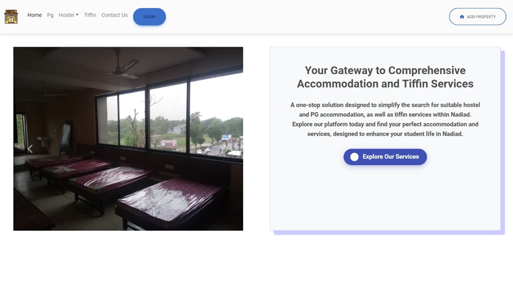

## Project Overview

This is a full-stack web application built with Django Rest Framework, React JS, and SQL to address common challenges faced by students when searching for suitable accommodation and meal services. The site provides a centralized platform where students can browse verified listings for PG accommodations, hostels, and tiffin services.

## Key Features

- User-friendly search and filtering for student accommodations.
- Verified listings of PGs, hostels, and tiffin services.
- Built with Django Rest Framework (backend) and React JS (frontend).

## UI Preview

## GitHub Repository

You can find the source code and contribute on [GitHub](https://github.com/SetuBhatt1/Automatic-Information-Tracker-SDP-1.git).
