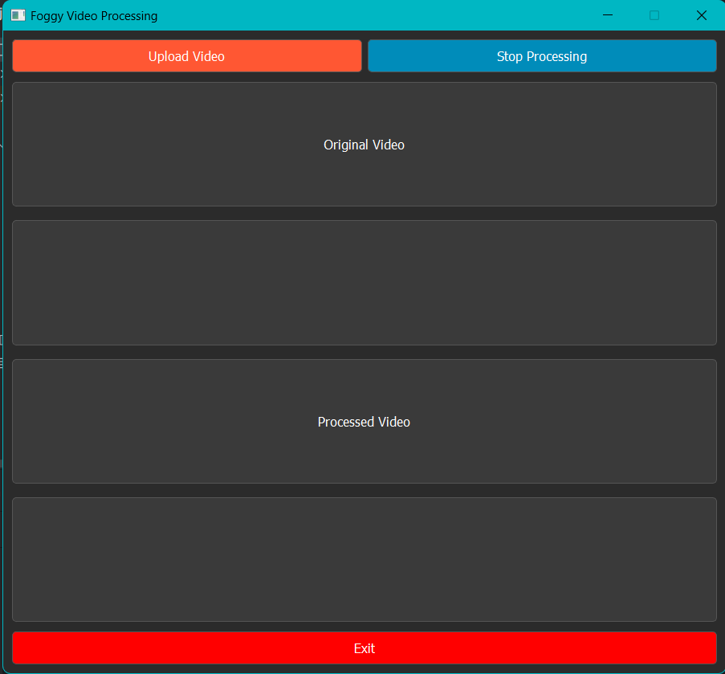
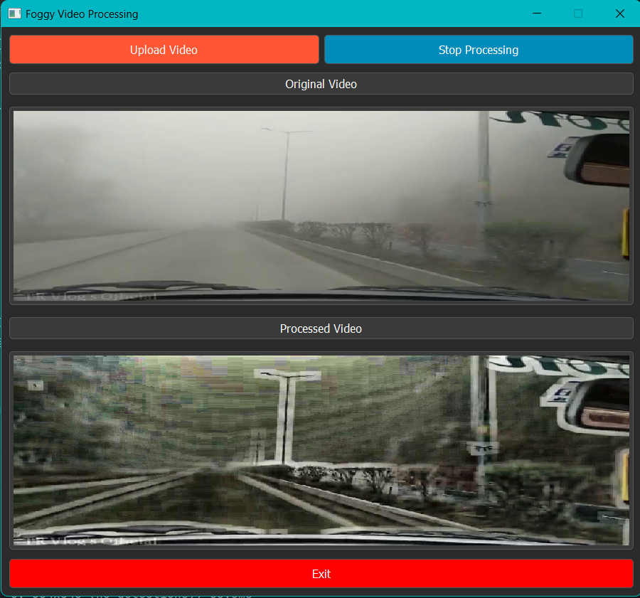

## Project Overview

This project presents a vehicle detection system tailored for foggy conditions. By merging traditional image processing techniques with cutting-edge object detection and tracking, the system significantly improves vehicle detection accuracy in dense fog. The approach employs **Dark Channel Prior (DCP)** and **Contrast Limited Adaptive Histogram Equalization (CLAHE)** to effectively clear fog before detecting vehicles. **YOLOv8** is utilized for detection, and **DeepSORT** for tracking, ensuring real-time performance with dependable results.

## Key Features

- **Fog Removal**: Applies Dark Channel Prior and CLAHE techniques to improve visibility by removing fog from frames.
- **High-Accuracy Detection and Tracking**: Uses YOLOv8 for vehicle detection and DeepSORT for object tracking, ensuring accurate and consistent detection across frames.
- **Real-Time Performance**: Operates at 25-30 FPS, suitable for real-world driving scenarios.

## Performance Metrics

- **Peak Signal-to-Noise Ratio (PSNR)**: Achieved 11.42 dB across 637 foggy frames.
- **Structural Similarity Index Measure (SSIM)**: Reached 0.324, indicating improved structural quality in enhanced images.
- **Detection Accuracy**: Improved by 55.4% under dense fog conditions and 45.7% in medium fog, as tested on real-world driving videos and the Foggy Cityscapes dataset.

## UI Preview

## Video Demo

Watch the video demo to see the system's performance under various fog conditions:

[Watch Video Demo](https://drive.google.com/file/d/1TSmo0pqkxx2J-DKhxloTRavIwtS6e8ku/view?usp=sharing)

## GitHub Repository

You can find the source code and contribute on [GitHub](https://github.com/ananya12k/Car_Detection_Low_Visibility_App).
