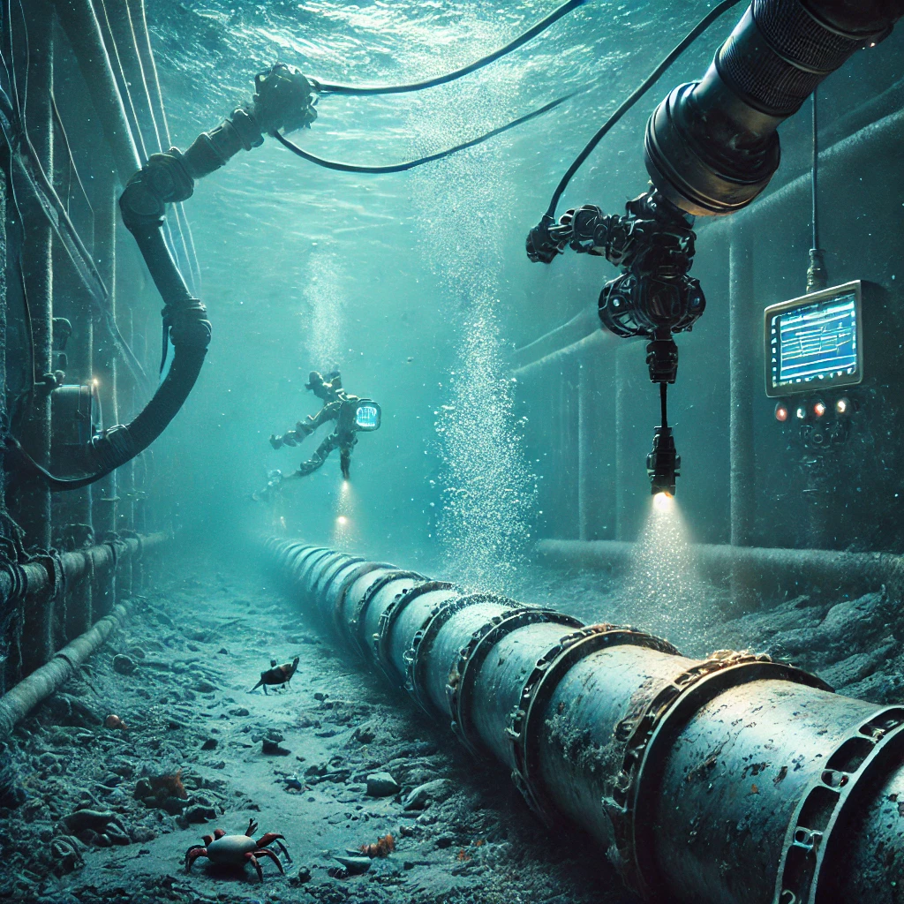

## Project Overview

This project focuses on utilizing AI to detect leaks in underground pipes. The objective was to build a deep learning model capable of analyzing data from sensors or pipe imaging systems to identify potential leaks. The model also timestamps each leak's occurrence and pinpoints its location, enabling quick and effective interventions. The project involved reviewing existing deep learning techniques and improving them for practical, real-world leak detection applications.

## Key Features

- **Leak Detection**: The model detects leaks in underground pipes with high precision, reducing reliance on manual inspection.
- **Location and Time Stamping**: Accurately identifies the leak’s location and time, facilitating rapid response and maintenance scheduling.
- **Deep Learning Approach**: Used advanced deep learning technique -LSTM for reliable and automated detection, reducing human error and increasing efficiency.

 <!-- Adjust image path as needed -->
 <!-- Adjust image path as needed -->

## GitHub Repository

You can find the source code and contribute on [GitHub](https://github.com/ananya12k/Leak_Detection_Underground_Pipes). <!-- Replace with the actual GitHub URL -->
