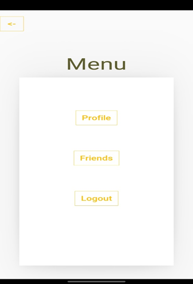

## Project Overview

This project involves the development of a robust SOS (Emergency) mobile application designed for quick access during emergencies. The app allows users to send emergency alerts with a single tap, providing vital information such as the user's location. The app integrates MongoDB for secure user data storage and Twilio API for making automatic emergency calls and sending SMS notifications to emergency contacts.

The app was developed as part of the **DevHeat Beta Hackathon**, where it was selected as one of the **top 10 finalists**. The goal of the app is to provide a reliable and easy-to-use tool for individuals in distress situations, ensuring quick access to help in critical moments.

## Key Features

- **Emergency Alerts**: Allows users to trigger an emergency alert with one tap, instantly notifying contacts.
- **Twilio API Integration**: Automates emergency calls and sends SMS notifications to predefined emergency contacts.
- **MongoDB Integration**: Secures user data by storing critical information in a MongoDB database.
- **User-Friendly Interface**: Developed with KivyMD, ensuring a simple and intuitive interface for users during emergencies.

## UI Preview

Here are some snapshots of the user interface used in the app:

 <!-- Adjust image path as needed -->
 <!-- Adjust image path as needed -->

## GitHub Repository

You can find the source code and contribute on [GitHub](https://github.com/ananya12k/Devheat_Beta_Coding_Geeks.git). <!-- Replace with the actual GitHub URL -->
