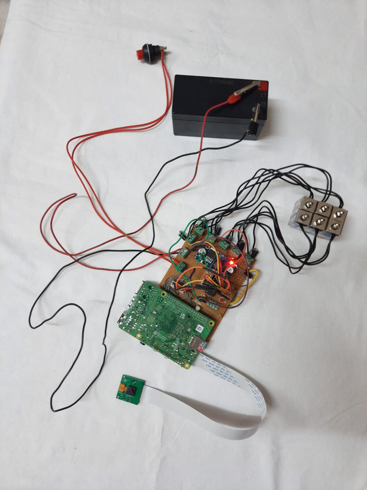
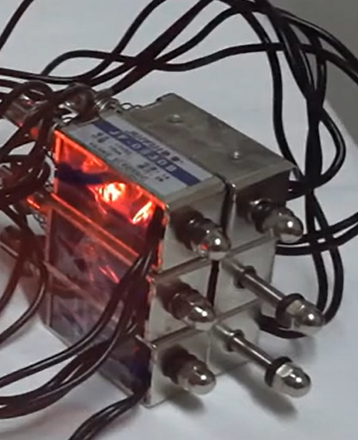

## Project Overview

SMART NOTEBOOK is an IoT-based assistive technology project designed to help visually impaired students, particularly in developing nations like India. The project was funded with ₹35,750 by the Government of Gujarat under the Student Startup and Innovation Policy (SSIP) initiative, aimed at fostering innovation and supporting student-led projects. It was developed under the mentorship of Assistant Prof. Viral H. Shah.

The SMART NOTEBOOK uses Optical Character Recognition (OCR) technology to convert printed or digital text into Braille patterns, making educational resources more accessible to visually impaired students.

## Key Features

- Converts text to Braille patterns using OCR technology.
- Provides an affordable and accessible learning tool for visually impaired students.
- Targets educational equity for underrepresented communities.

## UI Preview

## Video Demo

You can watch the video demo of the SMART NOTEBOOK project below:

[SMART NOTEBOOK Video Demo](https://drive.google.com/file/d/19OJm5eHzGjmOvwQDg05KRMJ5XEQoDS-p/view?usp=sharing)

## Funding & Recognition

This project received funding of ₹35,750 from the Government of Gujarat under the Student Startup and Innovation Policy (SSIP) initiative, which provides support for student-led innovations. A certificate of recognition was awarded for the successful completion and funding of this project.

[Download SSIP Certificate (PDF)](./ssip_certificate.pdf)

## GitHub Repository

You can find the source code and contribute on [GitHub](https://github.com/ananya12k/OCR_Rpi).
