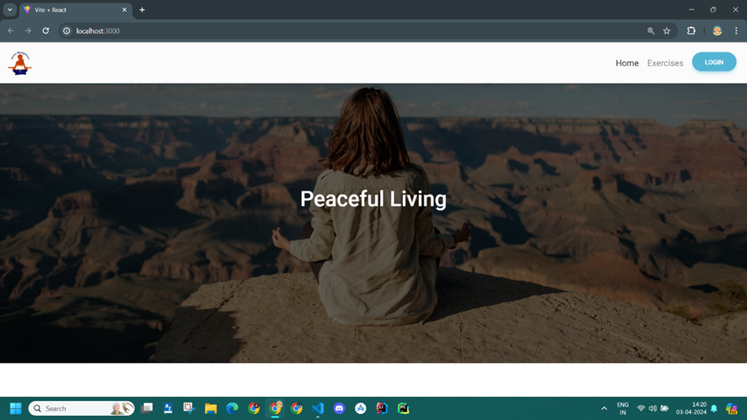
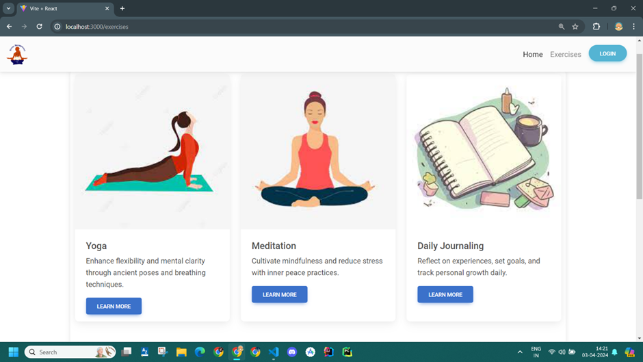

## Project Overview

This project involves the development of a full-stack website aimed at helping users manage stress through various exercises. The website includes features like breathing exercises, gratitude journaling, and diary writing to promote mental well-being. Built using Spring Boot for the backend, React JS for the frontend, and PostgreSQL for data storage, the application allows users to engage in stress-relief activities in a structured, accessible manner. The goal is to provide users with simple, effective tools to manage stress and improve mental health.

## Key Features

- **Breathing Exercises**: Provides guided breathing exercises to help reduce stress and promote relaxation.
- **Gratitude Journaling**: Allows users to write daily gratitude entries, encouraging positive thinking.
- **Diary Writing**: Offers a private space for users to express their thoughts and emotions through writing.
- **User-Friendly Interface**: Developed with React JS to ensure an easy and intuitive user experience.

## UI Preview

Here are some snapshots of the user interface used for the various stress-relief activities:

 <!-- Adjust image path as needed -->
 <!-- Adjust image path as needed -->

## GitHub Repository

You can find the source code and contribute on [GitHub](https://github.com/ananya12k/stress-relief-app-frontend). <!-- Replace with the actual GitHub URL -->
